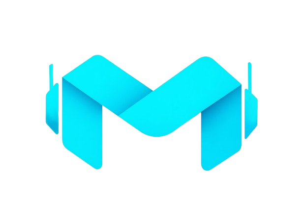

<div align="center">



# MultimateAi

**Your Agentic Software Application**

AI-powered multi-agent platform that sends messages, automates workflows, and manages services — all without human intervention.

[](LICENSE)
[](https://www.electronjs.org/)
[](https://react.dev/)
[](https://www.typescriptlang.org/)

</div>

---

## What It Does

MultimateAi is a desktop application that orchestrates AI agents across multiple platforms. It connects to your existing services and automates complex tasks using multi-agent workflows.

### Core Features

- **Multi-Agent Workflow** — Chain multiple AI models to solve complex tasks in sequence, range, or simultaneously
- **Service Integrations** — Slack, Telegram, Notion, N8n, Google Sheets, Google Docs
- **AI Chat** — Chat with any supported AI model (OpenAI, Anthropic, Groq, DeepSeek, Mistral, Ollama, OpenRouter)
- **Video Analysis** — Upload videos, transcribe, and generate AI-powered summaries
- **Email Automation** — Send emails via SMTP with AI-generated content
- **Usage Analytics** — Track token usage, costs, and activity across providers
- **Scheduling** — Cron-based message scheduling for Telegram and Slack
- **Voice Input** — Record and transcribe voice messages

### Supported AI Providers

| Provider | Models |
|----------|--------|
| OpenAI | GPT-4o, GPT-4o-mini, GPT-4.1, o1, o3, o4-mini |
| Anthropic | Claude 3.5 Sonnet, Claude 3 Opus, Claude 3 Haiku |
| Groq | Llama 3.3 70B, Mixtral 8x7B, Gemma 2 9B |
| DeepSeek | DeepSeek Chat, DeepSeek Reasoner |
| Mistral | Mistral Large, Mistral Small, Codestral |
| Ollama | Any local model |
| OpenRouter | All supported models |

---

## Tech Stack

| Layer | Technology |
|-------|------------|
| **Frontend** | React 18, TypeScript, Tailwind CSS 4 |
| **Desktop** | Electron 30 |
| **State** | Zustand (client), TanStack Query (server) |
| **UI Components** | Radix UI, Lucide Icons, Framer Motion, Recharts |
| **AI Framework** | LangChain.js, LangGraph |
| **Build** | Vite 5, electron-builder |
| **Routing** | React Router DOM 7 |
| **Styling** | Tailwind CSS 4, tw-animate-css |

---

## Installation

### Prerequisites

- [Node.js](https://nodejs.org/) >= 18
- [Git](https://git-scm.com/)
- [pnpm](https://pnpm.io/) (recommended) or npm

### Steps

```bash
# Clone the repository
git clone https://github.com/NarihitoM/MultimateAi.git
cd MultimateAi

# Install dependencies
npm install

# Start development server
npm run dev
```

### Available Scripts

| Command | Description |
|---------|-------------|
| `npm run dev` | Start Vite dev server + Electron |
| `npm run build` | Build for production (TSC + Vite + Electron Builder) |
| `npm run deploy` | Build and publish release |
| `npm run lint` | Run ESLint |
| `npm run preview` | Preview production build |

---

## Project Structure

```
src/
├── features/                  # Feature-based modules
│   ├── account/               # User account settings
│   ├── agent/                 # Multi-agent workflow
│   ├── auth/                  # Authentication
│   ├── chat/                  # AI chat
│   ├── dashboard/             # Dashboard overview
│   ├── email/                 # Email service
│   ├── google/                # Google Sheets & Docs
│   ├── n8n/                   # N8n integration
│   ├── notion/                # Notion integration
│   ├── services/              # API key management
│   ├── slack/                 # Slack integration
│   ├── telegram/              # Telegram integration
│   ├── usage/                 # Usage analytics
│   ├── video-analysis/        # Video transcription
│   └── voice/                 # Voice recording
│
├── shared/                    # Cross-cutting concerns
│   ├── assets/                # Images & icons
│   ├── components/            # UI primitives & layout
│   ├── config/                # Configs & constants
│   ├── hooks/                 # Shared hooks
│   ├── lib/                   # Utilities
│   ├── routes/                # Route guards
│   ├── types/                 # Global types
│   └── utils/                 # Helper functions
│
├── pages/                     # Page components
├── App.tsx                    # Root component
└── main.tsx                   # Entry point
```

Each feature follows the same structure:

```
features/{name}/
├── api/           # API calls
├── components/    # UI components
├── hooks/         # React Query hooks
├── store/         # Zustand store (UI state only)
├── types/         # TypeScript types
└── index.ts       # Barrel export
```

---

## Configuration

Create a `.env` file in the root:

```env
VITE_SUPABASE=your_supabase_url
VITE_API_URL=your_backend_url
```

Add your AI provider API keys through the app's **Service Settings** page.

---

## License

[MIT](LICENSE)
